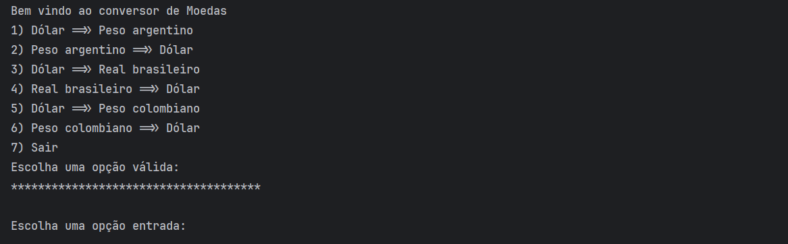
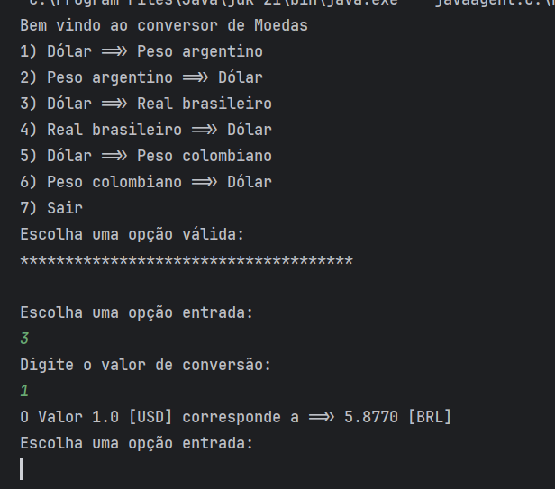
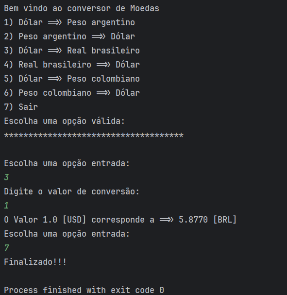

## Conversor de Moedas

<h2>1. Menu de Conversão</h2>

Neste programa você poderá escolher no menu a opção de conversão que deseja realizar:

<h2>2. Processo de Conversão</h2>

Em seguida, informe a opção que deseja escolher e o valor que quer converter:

<h2>3. Encerrando o Programa</h2>

Ao informar a opção 7, o programa finalizará:

